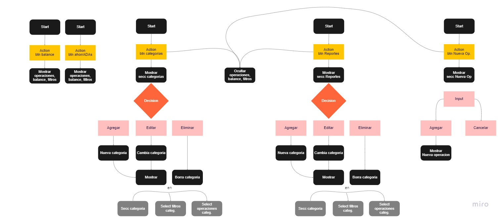

# PROYECTO-FINAL-MODULO-3-4
### > Alumnas _Angeles_ _Godoy_ y _Ruth_ _Ponteprino_ 

## ahorrADAs
> Este es el tercer proyecto realizado con **HTML, CSS y JS** desde _cero_
> Se trata de una aplicación que permite al usuario llevar un **registro** de los **gastos** realizados y de los **ingresos** obtenidos. 
> Podrás nuestro proceso de aprendizaje en la carrera de Desarrollo Frontend de **ADA itw**

### 👩‍💻 Pseudocódigo que representa el algoritmo para realizar una aplicación que permite al usuario llevar un **registro** de sus **gastos** e **ingresos**. 

>Funcionalidades principales
- **Operaciones**: agregar, editar y eliminar
- Cada operación debe contar con:
    - Descripción
    - Monto
    - Tipo de operación (gasto o ganancia)
    - Categoría a la que pertenece
    - Fecha de realización
- **Categorías**: agregar, editar y eliminar.
- Cada categoría debe contar con un nombre
- Al eliminar una categoría, se deben eliminar todas las operaciones asociadas a ella.
- **Filtro operaciones**:
    - Tipo de operación (gasto, ganancia o ambas)
    - Categoría a la que pertenece (una en específico o cualquiera)
    - Fecha de realización (a partir de la fecha seleccionada)
- **Ordernar/Filtrar operaciones**:
    - Fecha de realización (más y menos reciente)
    - Monto (mayor y menor)
    - Descripción (en orden alfabético creciente y decreciente)
- **Balance**:  
    - Ganacias
    - Gastos
    - Total (ganancias menos gastos)
- **Reportes**:
    - Resumen:
    - Categoría con mayor ganancia
    - Categoría con mayor gasto
    - Categoría con mayor balance
    - Mes con mayor ganancia
    - Mes con mayor gasto
    - Totales (gastos, ganancias y balances) por categoría
    - Totales (gastos, ganancias y balances) por mes
- **Guardar datos** en almacenamiento local del navegador o firebase

### 👩‍💻 Diagrama de Flujo

[miro](https://miro.com/app/board/uXjVPdx3wCg=/)

### 👩‍💻 Paleta de colores

Te dejo el link para que visites mi sitio [Proyecto Final Modulo 3 - 4](https://ruthponteprino.github.io/ahorradas/)

